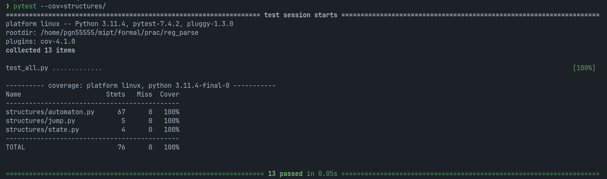

# Фиксированное число вхождений буквы в словах языка

## Запуск программы

Сначала склонируйте репозиторий:

    git clone https://gitlab.akhcheck.ru/maksim.ivanov/reg_parse.git

*Следующие команды надо выполнять из папки проекта.*

Установите необходимые компоненты:

    pip3 install -r requirements.txt

Программа реализована как отдельная библиотека Python. Ниже показан пример её использования:

    from regex_task import Regex
    r = Regex(input_string) # input_string - input from task
    r.is_include()

Запустите программу следующей командой:

    python3 name.py # name.py - name of your program

## Тесты

Тесты запускаются следующей командой:

    pytest --cov=structures/

Результаты тестирования:

## Описание алгоритма

Описание алгоритма с доказательством асимптотики находится по пути `docs/algo.pdf`.
